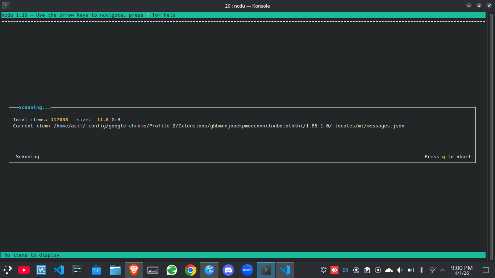
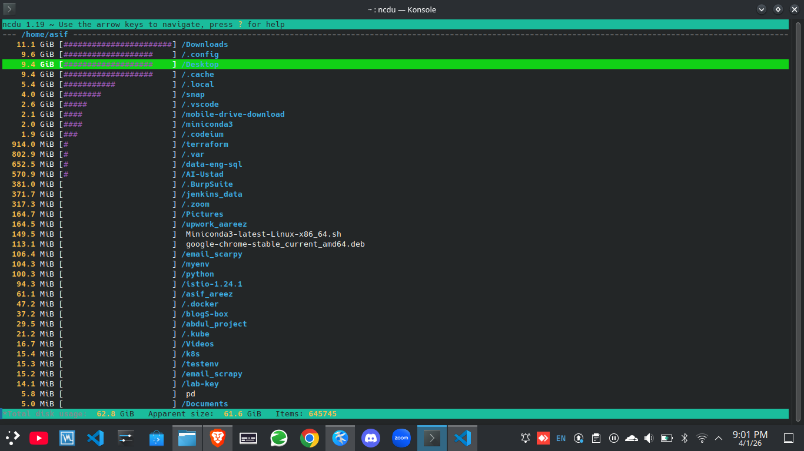

# ncdu: Quickly Find What’s Eating Your Disk Space

It started like many production incidents do.
The server became slow, deployments failed, and then the message appeared:

**“No space left on device.”**

There was no time to guess or run slow commands. I needed to find what was consuming disk space—and fast. That’s when I used **ncdu**, a small but extremely effective Linux tool.

---

## What Is ncdu?

`ncdu` (NCurses Disk Usage) is a terminal-based disk usage analyzer.
It scans directories and presents disk usage in an interactive interface, allowing you to quickly identify large files and folders.

Unlike plain `du` output, ncdu is easy to navigate and ideal during disk space emergencies.

---
## Installing ncdu

```bash
# Debian / Ubuntu
apt install ncdu

# RHEL / CentOS / Rocky
dnf install ncdu
```


---

## Running ncdu

To scan the entire filesystem:

```bash
sudo ncdu /
```

You can also scan a specific directory for faster results:

```bash
ncdu /var
```
---


---
## Interactive Tips for Using ncdu

ncdu is fully interactive and easy to use from the keyboard.

### Navigation

* Use **Up / Down arrow keys** to move
* Press **Enter** to open a directory
* Press **Left Arrow** or **Backspace** to go up one level

### Sorting

* Press **`s`** to sort by size
* Press **`n`** to sort by filename

### Quick Navigation

* Press **`g`** to jump to the top
* Press **`G`** to jump to the bottom

### Deleting Files

* Press **`d`** to mark a file or directory for deletion
* Confirm before deleting
  *(Always review carefully, especially on production systems)*
---

---

## Export Disk Usage Results

You can save scan results for later analysis or sharing:

```bash
ncdu -o output.json /path
ncdu -f output.json
```

This is useful for offline review or comparing disk usage over time.

---

## When ncdu Is Most Useful

* Disk full emergencies
* Identifying oversized log files
* Investigating Docker or backup growth
* Quick cleanup on servers without a GUI

ncdu shines when you need answers **immediately**.
---

## Final Thoughts

Disk space issues rarely give advance warning. When they happen, having the right tool matters more than anything else.
ncdu is simple, fast, and reliable—and it deserves a place in every Linux administrator’s toolkit.

If you found this blog helpful, please **share it with your team or the community** so others can resolve disk space issues faster.

#Linux #DevOps #SysAdmin #ncdu #LinuxTools #Troubleshooting
---
