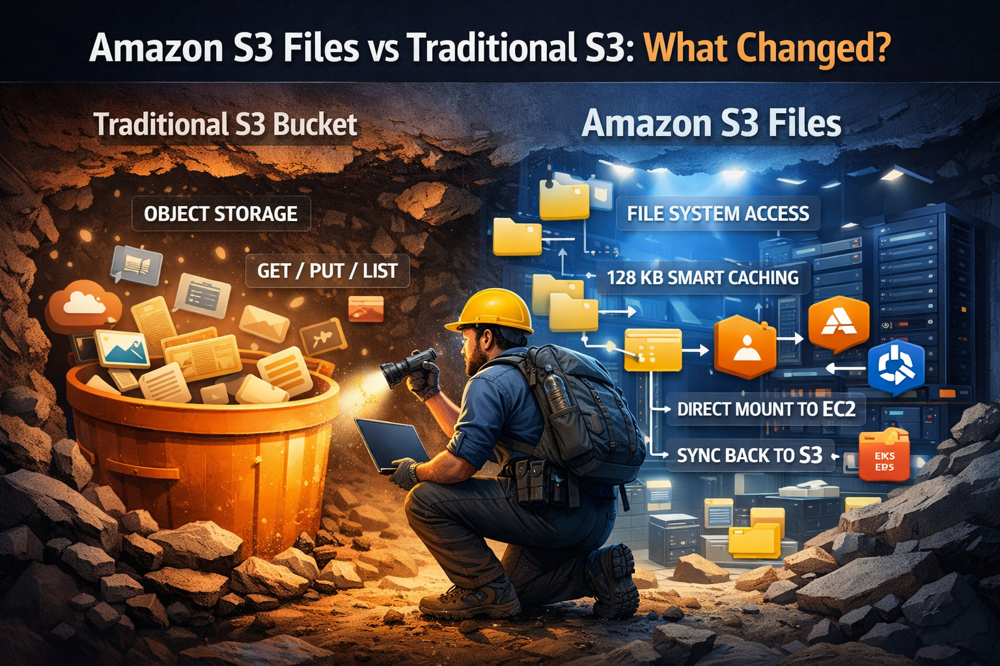

# Amazon S3 Files: The Storage Upgrade We've Been Waiting For

> AWS just gave S3 a superpower — file system access, without leaving object storage. Here's everything you need to know.

**Category:** AWS Deep Dive &nbsp;|&nbsp; **Read time:** ~10 min &nbsp;|&nbsp; **Level:** Beginner Friendly

---

## 1. What is Amazon S3 Files?

Amazon S3 has always been the gold standard for storing data in the cloud — cheap, durable, and infinitely scaleable. But it had one frustrating limitation: **you couldn't treat it like a regular hard drive.**

You couldn't just open a file, edit a line, and save it back. You couldn't list folders naturally. Applications built around traditional file systems didn't "speak S3." Every read and write required an API call.

**Amazon S3 Files changes that.**

It lets you **mount your S3 bucket** on any compute resource — EC2, Lambda, EKS, ECS — and work with your data like it's a normal file system. No code rewrites. No data migration. No leaving S3.

> **⚡ One-liner:** According to [AWS documentation](https://docs.aws.amazon.com/AmazonS3/latest/userguide/), S3 Files is "built using Amazon EFS" and gives you "the performance and simplicity of a file system with the scalability, durability, and cost-effectiveness of S3." Both worlds in one service.

---

## 2. Traditional S3 vs. S3 Files — What Actually Changed?

To understand why this matters, you need to understand the old problem.

| Feature | Traditional S3 | S3 Files |
|---|---|---|
| Access method | HTTP (API calls) | File system mount (NFS 4.2) |
| Works with existing apps | Only if S3-aware | Any file-based app ✅ |
| Small file latency | Higher (API overhead) | Low latency when cached ✅ |
| Create / edit / delete | Put/Delete APIs only | Standard file ops ✅ |
| POSIX permissions | Not supported | Supported via NFS mount ✅ |
| Cost | S3 pricing | S3 pricing + small active-data cache fee |

The key insight: **your data never leaves S3.** It's still stored there, priced like S3, as durable as S3. S3 Files just gives you a smarter way to interact with it.

---

## 3. The S3 Files Workflow — Day to Day

Once you set up S3 Files and mount your bucket, your workflow becomes exactly like working with a local disk.

**Browse and list files**
```bash
ls /mnt/s3files
```
Your bucket contents appear as folders and files.

**Create and edit**
```bash
echo "Hello, S3 Files!" > /mnt/s3files/test.txt
```
Write files with any tool — vim, Python scripts, anything. No SDK needed.

**Create directories and copy files**
```bash
mkdir /mnt/s3files/test-directory
cp /mnt/s3files/test.txt /mnt/s3files/test-directory/
```

**Read files**
```bash
cat /mnt/s3files/test.txt
```

**Changes sync back automatically.** Anything you create, edit, or delete is synced back to your S3 bucket in the background — typically within around a minute, though sync timing can vary. Nothing to trigger manually.

Any team member, any application, any tool that reads files can work with S3 data directly, without knowing or caring that it's S3 underneath.

---

## 4. No Other Cloud Does This (Yet)

AWS has merged two storage worlds that were always kept separate — **object storage** and **file systems** — without forcing you to pick one.

> *"Before S3 Files, you had to choose: cheap scalable object storage, or fast file system access. Now you don't."*

Azure Blob Storage and Google Cloud Storage both offer NFS-compatible options (Azure Files, Google Filestore), but these are separate managed services — not native file system access to your existing object storage buckets. You'd still manage separate services and build sync logic between them.

AWS has built that bridge as a first-party feature — with **NFS 4.2**, POSIX permissions, file locking, and read-after-write consistency built in.

---

## 5. How It Works — Architecture, Caching, and Consistency

This section covers everything about the internals in one place: the architecture, the 128 KB routing rule, large file handling, and how consistency is maintained.

### The Architecture

S3 Files does not copy your entire bucket to a file system. Instead, per [AWS documentation](https://docs.aws.amazon.com/AmazonS3/latest/userguide/), it uses **Amazon EFS as a high-performance caching layer** in front of S3:

```
Your Application
       │
       ▼
[ EFS High-Performance Layer ]  ← active/hot data cached here
       │
       ▼
  [ Amazon S3 Bucket ]          ← source of truth
```

Your S3 bucket remains the authoritative store. The EFS layer caches only the data you're actively working with. When you navigate a directory, S3 Files shows all your objects as files — but only loads actual file contents into EFS when you open or access a file. It is demand-based loading.

Data you haven't accessed within a configurable window (1–365 days, **default: 30 days**) is automatically evicted from the cache. Your S3 bucket is always intact.

### The 128 KB Routing Rule

S3 Files uses a **128 KB size threshold** (configurable) to decide where each read is served from:

**Files smaller than 128 KB** are eagerly loaded into the EFS cache. Once cached, they are served at low latency. AWS documentation describes this as "sub-millisecond to single-digit millisecond" for actively used small files. This is well-suited for config files, metadata, thumbnails, and small scripts where repeated S3 API calls would otherwise add overhead.

**Reads of 128 KB or larger** on data already synchronized to S3 are streamed **directly from S3**, bypassing the EFS layer. AWS documentation notes that S3 is optimized for high throughput at this scale. Actual throughput will depend on your workload and configuration.

This routing happens automatically. No configuration is required on your end.

### Dirty Files and Consistency

When you write a file through the mounted file system, it lands in EFS first and syncs to S3 in the background. S3 Files tracks these as **"dirty files"** — written to EFS but not yet synced to S3.

For any dirty file, **reads are always served from EFS**, regardless of file size. This ensures you always get the latest written data, never a stale version from S3.

> **🔒 Per AWS documentation:** S3 Files provides **read-after-write consistency** and "file-system-access semantics, such as read-after-write data consistency, file locking, and POSIX permissions."

This is why the large-file streaming optimization (reads going direct to S3) only applies to data that has **already been synchronized**. Recently modified data always comes from EFS until sync completes.

### Two-Way Sync

Synchronization runs automatically in both directions:

- **Importing** — changes made directly to your S3 bucket (outside the file system) are reflected in the file system view
- **Exporting** — changes you make through the file system are written back to your S3 bucket

S3 Files uses Amazon EventBridge rules under the hood to detect bucket-side changes and trigger import. This is why the IAM role for S3 Files requires EventBridge permissions — covered in the setup guide below.

---

## 6. Cost — You Only Pay for What You Use

The pricing model is one of the strongest practical arguments for S3 Files.

Traditional EFS charges for all provisioned storage, whether accessed or not. S3 Files works differently:

**You pay:**
- Standard S3 storage rates for your **full dataset**
- A high-performance storage fee **only for the active working set** currently in the EFS cache
- Standard S3 GET/PUT request costs for reads served directly from S3

**Example:** If you have 10 TB in S3 but only 200 GB is actively accessed — you only pay the cache rate on that 200 GB. The remaining 9.8 TB stays at regular S3 pricing with no cache premium.

> **Note on pricing:** Exact rates vary by region and change over time. Always check the [S3 Files pricing page](https://aws.amazon.com/s3/pricing/) before making cost comparisons. The general model — paying only for active data in the cache — is described in the [official documentation](https://docs.aws.amazon.com/AmazonS3/latest/userguide/).

For large datasets with variable access patterns — ML pipelines, media archives, log stores — this model can be meaningfully cheaper than dedicated EFS, depending on your specific access patterns.

---

## 7. Where S3 Files Really Shines

S3 Files adds the most value in these specific workloads:

**Workloads with many small files**
Plain S3 treats every file as a separate HTTP request. Thousands of small reads add up fast. S3 Files caches frequently accessed small files on EFS, reducing per-file overhead for repeated reads significantly.

**ML inference pipelines**
Loading model configs, tokenizer files, and small input batches at low latency — without needing to copy data to a separate EFS volume before each run.

**Legacy applications that expect a file system**
Applications built around POSIX file operations (open, read, write, seek) can now access S3 data without code changes or an S3 SDK integration.

**Multi-service data sharing**
Multiple compute resources can mount the same S3 file system simultaneously and use it as shared storage, without managing a separate EFS instance.

**Data pipelines reading many small CSVs or JSONs**
Batch processing jobs that open hundreds or thousands of small structured files benefit from the small-file caching behavior.

---

## 8. Trade-offs — When Not to Use It

S3 Files is genuinely useful, but it is not the right tool for every situation.

**When your workload needs consistently low-latency writes**
Writes go to EFS first and sync to S3 asynchronously. If your application depends on guaranteed synchronous write-through to durable storage on every operation, dedicated EFS with higher IOPS provisioning may be more predictable.

**When you have a very write-heavy, high-IOPS workload**
For workloads like databases or high-frequency logging, EFS or EBS is better suited. S3 Files is optimized around a read-heavy, mixed-access model.

**When your application requires features S3 Files does not support**
S3 Files has documented limitations. As of launch, certain file system features like hard links and some advanced NFS operations are not supported. Check the [unsupported features list](https://docs.aws.amazon.com/AmazonS3/latest/userguide/) in the official documentation before committing to it.

**When sync latency matters between systems**
Changes made through the file system sync back to S3 in the background — typically within a minute, but not instantaneously. If another system reads directly from S3 and needs to see file system changes immediately, you need to design around this window.

**When you need cost predictability on stable, high-utilization workloads**
The pay-for-active-data model works well for variable access patterns, but for consistently high-utilization workloads, compare actual numbers against dedicated EFS before assuming S3 Files is cheaper.

> **Bottom line:** S3 Files is well-suited for read-heavy, mixed-access, and small-file-heavy workloads where you want S3 economics with file system ergonomics. For high-IOPS write workloads or applications with strict write-latency requirements, evaluate the alternatives before committing.

---

## 9. Where You Can Mount It

S3 Files works across all major AWS compute services:

| Compute Service | How to Connect | Notes |
|---|---|---|
| 🖥️ **Amazon EC2** | `amazon-efs-utils` + `mount` command | Full setup covered below |
| ⚡ **AWS Lambda** | S3 Console → Attach to Lambda | Requires VPC config + access point |
| ☸️ **Amazon EKS** | EFS CSI driver | Supports dynamic + static provisioning |
| 📦 **Amazon ECS / Fargate** | Task definition volume config | EC2 launch type is **not** supported |

All compute resources must run in the **same VPC** as the file system's mount targets. Communication happens over NFS port 2049.

---

## 10. Things Worth Knowing Before You Start

**S3 versioning is required.**
Your bucket must have versioning enabled. S3 Files relies on it to track changes and maintain sync.

**One mount target per Availability Zone.**
You can create one mount target per AZ. AWS recommends one per AZ for high availability. The console creates these automatically in your default VPC.

**Sync timing varies in both directions.**
Changes through the file system typically sync to S3 within a minute. Changes made directly to S3 are also imported, but timing varies. Design accordingly if other systems read S3 directly.

**Encryption is always on.**
S3 Files encrypts all data in transit using TLS and at rest using AWS KMS. This cannot be disabled.

**The console removes most of the manual setup.**
Creating a file system through the AWS Management Console automatically creates the IAM role, mount targets in every AZ of your default VPC, and one access point. Strongly recommended if you're getting started.

---

## 11. Final Take

Storage has always forced a hard choice on developers: **pay for performance, or pay for scale.** File systems gave you speed but were expensive and rigid. Object storage gave you scale but required rewriting your applications to speak HTTP.

For years, teams patched this gap with custom sync scripts, dual-write logic, and middleware that added complexity without solving the root problem.

**S3 Files removes that trade-off — for the workloads it's designed for.**

Your data stays in S3 — affordable, durable, globally accessible. You interact with it the way applications have always worked with storage: as files, with normal commands. No re-architecture. No migration. No new SDK to learn.

The use cases are concrete. Legacy apps that couldn't talk to S3 now can. Data pipelines that needed a shared file system can use S3 directly. ML workflows wrestling with small-file overhead have a real answer. Teams that couldn't justify EFS costs for large cold datasets now have a cost-effective path.

It is not a replacement for EFS or a silver bullet for every storage problem. But for the right workloads, it is one of the more practical additions AWS has shipped in a while.

> *The best infrastructure is the kind you stop thinking about. For the right use case, S3 Files gets your storage layer out of the way — without making you give anything up.*

---

## 12. Complete Setup Guide

If you want to try it right now, here's the full setup — otherwise the official docs [AWS documentation](https://docs.aws.amazon.com/AmazonS3/latest/userguide/)

### Prerequisites Checklist

| # | Requirement | Where to Check |
|---|---|---|
| 1 | AWS account with sufficient IAM permissions | AWS Console → IAM |
| 2 | An S3 **general purpose** bucket in your target region | S3 Console |
| 3 | Bucket versioning **enabled** | S3 → Bucket → Properties |
| 4 | Bucket encryption set to **SSE-S3 or SSE-KMS** | S3 → Bucket → Properties |
| 5 | An EC2 instance in the **same region** as your bucket | EC2 Console |
| 6 | EC2 instance has an **IAM instance profile** attached | EC2 → Instance → Security |
| 7 | `amazon-efs-utils` **version 3.0.0+** available to install | Confirmed in Step 6 |

---

### Step 1 — Enable Versioning on Your S3 Bucket

**Via Console:**
```
S3 Console → Your Bucket → Properties → Bucket Versioning → Enable
```

**Via CLI:**
```bash
aws s3api put-bucket-versioning \
  --bucket YOUR_BUCKET_NAME \
  --versioning-configuration Status=Enabled
```

Also confirm Default Encryption shows SSE-S3 or SSE-KMS:
```
S3 Console → Your Bucket → Properties → Default Encryption
```

---

### Step 2 — Create the IAM Role for S3 Files

> **💡 Console shortcut:** If you create your file system via the AWS Console, this role is created automatically. Skip to Step 3.

For manual setup, create an IAM role with this **trust policy**:

```json
{
  "Version": "2012-10-17",
  "Statement": [
    {
      "Effect": "Allow",
      "Principal": { "Service": "elasticfilesystem.amazonaws.com" },
      "Action": "sts:AssumeRole",
      "Condition": {
        "StringEquals": { "aws:SourceAccount": "YOUR_ACCOUNT_ID" },
        "ArnLike": {
          "aws:SourceArn": "arn:aws:s3files:YOUR_REGION:YOUR_ACCOUNT_ID:file-system/*"
        }
      }
    }
  ]
}
```

Attach this **inline policy** (S3 + EventBridge permissions):

```json
{
  "Version": "2012-10-17",
  "Statement": [
    {
      "Sid": "S3BucketPermissions",
      "Effect": "Allow",
      "Action": ["s3:ListBucket", "s3:ListBucketVersions"],
      "Resource": "arn:aws:s3:::YOUR_BUCKET_NAME"
    },
    {
      "Sid": "S3ObjectPermissions",
      "Effect": "Allow",
      "Action": [
        "s3:GetObject*", "s3:PutObject*",
        "s3:DeleteObject*", "s3:AbortMultipartUpload", "s3:List*"
      ],
      "Resource": "arn:aws:s3:::YOUR_BUCKET_NAME/*"
    },
    {
      "Sid": "EventBridgeManage",
      "Effect": "Allow",
      "Action": [
        "events:PutRule", "events:PutTargets", "events:DeleteRule",
        "events:DisableRule", "events:EnableRule", "events:RemoveTargets"
      ],
      "Condition": {
        "StringEquals": { "events:ManagedBy": "elasticfilesystem.amazonaws.com" }
      },
      "Resource": ["arn:aws:events:*:*:rule/DO-NOT-DELETE-S3-Files*"]
    },
    {
      "Sid": "EventBridgeRead",
      "Effect": "Allow",
      "Action": ["events:DescribeRule", "events:ListRules", "events:ListTargetsByRule"],
      "Resource": ["arn:aws:events:*:*:rule/*"]
    }
  ]
}
```

> **Why EventBridge?** S3 Files uses EventBridge to detect changes made directly to your S3 bucket (outside the file system) and sync them back into the file system view. Without these permissions, two-way sync will not work.

---

### Step 3 — Create Your S3 File System

**Via Console (recommended):**
```
S3 Console → General Purpose Buckets → Select your bucket
→ File Systems tab → Create file system → Review VPC → Create
```

AWS automatically creates mount targets in every AZ of your default VPC and one access point. Allow 2–5 minutes.

**Via CLI:**
```bash
aws s3files create-file-system \
  --region YOUR_REGION \
  --bucket arn:aws:s3:::YOUR_BUCKET_NAME \
  --role-arn arn:aws:iam::YOUR_ACCOUNT_ID:role/YOUR_IAM_ROLE_NAME
```

Save the **file system ID** from the response — it looks like `fs-0123456789abcdef0`.

---

### Steps 4–7 at a Glance

| Step | What | Key Detail |
|---|---|---|
| **4** | Add IAM permissions to EC2 | `AmazonS3FilesClientFullAccess` + S3 inline read policy |
| **5** | Open security group port | TCP 2049 outbound EC2 → inbound Mount Target |
| **6** | Install client on EC2 | `amazon-efs-utils` v3.0.0+ |
| **7** | Mount the file system | `sudo mount -t s3files fs-xxxx:/ /mnt/s3files` |

---

### Step 4 — Attach IAM Permissions to Your EC2 Instance

```
IAM Console → Roles → Your EC2 Instance Role → Attach policies
→ Search and attach: AmazonS3FilesClientFullAccess
```

Also add this inline policy to enable direct S3 reads (required for the large-file routing optimization):

```json
{
  "Version": "2012-10-17",
  "Statement": [
    {
      "Effect": "Allow",
      "Action": ["s3:GetObject", "s3:GetObjectVersion"],
      "Resource": "arn:aws:s3:::YOUR_BUCKET_NAME/*"
    },
    {
      "Effect": "Allow",
      "Action": "s3:ListBucket",
      "Resource": "arn:aws:s3:::YOUR_BUCKET_NAME"
    }
  ]
}
```

---

### Step 5 — Configure Security Groups

| Security Group | Rule Type | Protocol | Port | Points To |
|---|---|---|---|---|
| EC2 Instance SG | Outbound | TCP | 2049 | Mount Target SG |
| Mount Target SG | Inbound | TCP | 2049 | EC2 Instance SG |

```
EC2 Console → Security Groups → EC2's SG → Outbound Rules
→ Add: TCP / 2049 / Destination = Mount Target Security Group ID

EC2 Console → Security Groups → Mount Target SG → Inbound Rules
→ Add: TCP / 2049 / Source = EC2 Instance Security Group ID
```

---

### Step 6 — Install the S3 Files Client

SSH into your EC2 instance:

```bash
# Amazon Linux 2 / RHEL
sudo yum install -y amazon-efs-utils

# Ubuntu / Debian
curl https://amazon-efs-utils.aws.com/efs-utils-installer.sh | sudo sh -s -- --install
```

Confirm version is 3.0.0 or higher:
```bash
mount.s3files --version
```

---

### Step 7 — Mount and Verify

```bash
# Create the mount point
sudo mkdir /mnt/s3files

# Mount your file system
sudo mount -t s3files fs-0123456789abcdef0:/ /mnt/s3files

# Verify
df -h /mnt/s3files
findmnt -T /mnt/s3files
```

Expected output from `df -h`:
```
Filesystem        Size  Used  Avail  Use%  Mounted on
fs-xxxx.s3files   8.0E  0     8.0E   0%    /mnt/s3files
```

---

### Step 8 — Test It

```bash
ls /mnt/s3files
echo "Hello from S3 Files!" > /mnt/s3files/hello.txt
cat /mnt/s3files/hello.txt
mkdir /mnt/s3files/my-folder
cp /mnt/s3files/hello.txt /mnt/s3files/my-folder/
```

Check your S3 bucket in the console after ~1 minute — `hello.txt` and `my-folder/` will appear there.

---

### Step 9 — (Optional) Auto-Mount on Reboot

```bash
sudo nano /etc/fstab
```

Add this line (`_netdev` is required — omitting it can cause the instance to become unresponsive on boot):

fs-0123456789abcdef0:/ /mnt/s3files s3files _netdev,nofail 0 0


Test without rebooting:

```bash
sudo mount -a
findmnt -T /mnt/s3files

```
---

## Feel free to reach out!

### Here are some ways to connect with me:

###  Social Media:

- [LinkedIn](https://www.linkedin.com/in/asif-muzammil-hussain-b6742441/)
- [GitHub](https://github.com/asifMuzammil/github-actions-docker-ghcr)
- [AWS Community Builder](https://builder.aws.com/community/@asifaws?tab=badges)
- [Personal Email](m.asif.muzammil@gmail.com)
- [Medium](https://medium.com/@m.asif.muzammil)
- [Kaggle](https://www.kaggle.com/asifmuzammil)

---